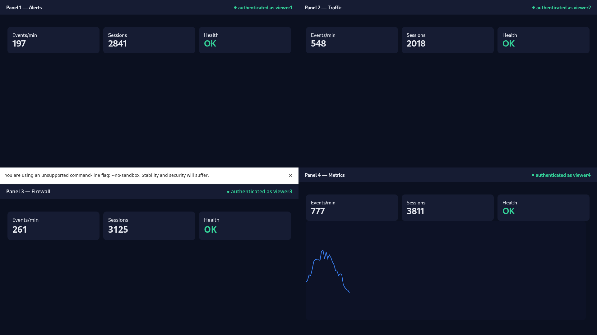

# p2soc — Raspberry Pi 5 → SOC Video Wall

[](LICENSE)


Convert a Raspberry Pi 5 (1 GB) into a **Security-Operations-Center video wall**:
an HDMI display that boots straight into a **taskbar-less desktop with four
draggable browser windows in a 2×2 grid**. Each window shows a different web
panel (different IP/port), **auto-logs in** from a local secrets vault, and
**keeps the session alive / re-logs-in** on timeout. One or more panels can live
on a remote network reached only through an **SSH jump host**, kept up by a
persistent **autossh** tunnel. Everything starts on boot and self-heals.

Built entirely from open-source parts: **Openbox + WebKitGTK** (with a
**Chromium** fallback per panel), **Vaultwarden** + **rbw**, **autossh**,
**systemd**, **zram**.



> Produced by the dev harness (`make verify`): four panels logged in — WebKit
> direct, WebKit through a tunnel, Chromium via CDP, and a WebKit panel with a
> live chart.

## Docs

- [Architecture](docs/ARCHITECTURE.md) — topology, boot/data-flow, RAM budget, rationale
- [Install on the Pi](docs/INSTALL.md) — step-by-step bring-up + checklist
- [Configuration](docs/CONFIGURATION.md) — `panels.yaml` reference, finding selectors, keep-alive
- [Security](docs/SECURITY.md) — threat model, the unattended-unlock tradeoff, hardening
- [Development](docs/DEVELOPMENT.md) — dev harness, make targets, testing

---

## How it works

```
systemd (system)
  ├─ zram (zstd)                compressed swap so 1 GB holds 4 panels
  ├─ vaultwarden.service        encrypted vault on 127.0.0.1:8222
  └─ autossh-tunnel.service     autossh -L 127.0.0.1:191xx:remote:port  user@jump

getty@tty1 autologin (soc) → startx → Openbox (no panel)
  └─ autostart → launcher.sh → kiosk host (Python / PyGObject)
        ├─ rbw unlock + sync → read the 4 logins into RAM
        ├─ engine: webkit  → GTK window + WebKitWebView; native login injection
        └─ engine: chromium→ chromium --app + CDP login injection (localhost)
   Openbox rc.xml forces each WM_CLASS=soc-pN window into its 2×2 cell (draggable)
```

**Auto-login is injected by the host**, not by a browser extension or a network
service: the host reads credentials from the vault and types them into each
view itself (WebKit via a `socCreds` message handler; Chromium via the DevTools
Protocol on localhost). There is **no credential broker, no open port, no
page-context fetch** — credentials never leave the host process except as the
values typed into the login form.

**Why these choices on 1 GB:** the 4 panels are different `IP:port` origins, so
cookies isolate naturally — no need for 4 browser profiles. WebKitGTK shares one
process tree (~250–450 MB) versus four Chromium renderers (~600–800 MB), so
Chromium is opt-in per panel. zram + throttled chart refresh absorb the rest.

---

## Repo layout

| Path | What |
|------|------|
| `config/panels.yaml` | **the** config: 4 panels (engine, url/tunnel, selectors, keepalive, grid) |
| `kiosk-host/host/` | the host: `main.py`, `webkit_panel.py`, `chromium_panel.py`, `vault.py`, `inject.py`, `config.py` |
| `inject/login.js.tmpl` | shared auto-login + keep-alive + re-login script (both engines) |
| `openbox/` | `rc.xml.tmpl` (2×2, no panel, draggable), `menu.xml`, `autostart` |
| `scripts/` | `launcher.sh`, `autossh-tunnel.sh`, `gen-openbox-rc.py`, `tunnel-args.py`, `pinentry-soc.sh`, `xinitrc` |
| `systemd/` | `vaultwarden(-docker).service`, `autossh-tunnel.service`, `getty-autologin.conf` |
| `security/` | `nftables.conf`, `sshd_hardening.conf`, `zram.conf`, `99-soc-sysctl.conf`, `tunnel_key.note` |
| `dev/` | dummy panels, vault seeding, tunnel stand-in, `verify.sh`, `run-wall.sh` |
| `install.sh` | idempotent Raspberry Pi installer |

---

## Try it on your workstation (no Pi needed)

Requires: `python3` + `python3-gi` + `gir1.2-webkit2-4.x`, `Xvfb`/`Xephyr`,
`chromium`, ImageMagick (`import`). Then:

```bash
make verify     # headless: brings up 4 dummy panels + the host, asserts logins,
                # tunnel gate, Chromium CDP, writes dev/run/verify.png
make dev        # interactive: shows the wall in a Xephyr window (Ctrl-C to stop)
make test       # unit tests (config geometry, injection escaping, vault backend)
```

`make verify` uses the **dev vault backend** (a JSON file) so it needs no
Vaultwarden. To exercise the real **rbw → Vaultwarden** path:

```bash
make vault      # starts Vaultwarden in Docker, registers an account,
                # seeds 4 logins via the API, verifies rbw can read them
```

---

## Install on the Raspberry Pi

Flash **Raspberry Pi OS (64-bit)**, enable SSH, boot, copy this repo over, then:

```bash
sudo ./install.sh                 # VW_MODE=docker (default) | native ; HARDEN=1 to firewall
```

The installer: installs deps, creates the `soc` (kiosk) and `socsvc` (tunnel)
users, deploys to `/opt/soc-display`, builds the venv, lays down `/etc/soc-display`
config, sets up Vaultwarden + autossh systemd units, zram, the Openbox session,
and tty1 autologin. It **disables the desktop session** (keeps your preloaded
card; the desktop just doesn't run) — same RAM benefit as Pi OS Lite, reversible.

Then finish setup (the installer prints this):

1. `‎/etc/soc-display/panels.yaml` — your 4 panels (IPs, ports, **selectors**, `vault_item`, tunnel).
2. `‎/etc/soc-display/soc.env` — `SOC_VAULT_PASSWORD`, email, url (`chmod 0640`).
3. `‎/etc/soc-display/vaultwarden.env` — `ADMIN_TOKEN` (`vaultwarden hash`).
4. `systemctl start vaultwarden`, create the kiosk account in the web vault, add
   the 4 logins **named to match each `vault_item`**.
5. Tunnel key: see `security/tunnel_key.note` (restricted `permitopen` key).
6. `systemctl reboot` → the wall comes up logged-in, hands-free.

### Finding selectors for a panel
Open the panel's login page in a browser, right-click the username field →
Inspect, and copy a CSS selector for the username input, password input, and the
submit button into `selectors:`. `login_marker` should be a selector that exists
**only** on the login page (usually the password field) — it's how the host
detects a logged-out state and re-logs-in.

---

## Configuration reference (`panels.yaml`)

```yaml
panels:
  - id: p1                      # short id; window class becomes soc-p1
    engine: webkit              # webkit (light, default) | chromium (fallback)
    grid: [0, 0]                # [col, row] in the 2x2 grid
    mode: direct                # direct | tunnel
    url: "http://10.0.0.5:3000/login"
    # for mode: tunnel, instead of url:
    # tunnel: {local_port: 19103, remote_host: 10.20.0.7, remote_port: 8443}
    # path: "/login"  ; scheme: http
    vault_item: "SOC Panel 1"   # Vaultwarden login item name
    selectors: {user: "#username", pass: "#password", submit: "button[type=submit]"}
    login_marker: "#password"   # exists only on the login page
    keepalive: {strategy: reload, intervalSec: 600}   # reload | click | xhr | none
```

For Grafana/Kibana-style panels, append kiosk/refresh params to the URL
(e.g. `...?kiosk&refresh=30s`) to cut RAM/CPU on the 1 GB Pi.

---

## Security model & tradeoffs

- **Vault**: Vaultwarden bound to `127.0.0.1`. The host reads via `rbw`; creds
  stay in a short-TTL in-RAM cache, never written to disk by the host, never
  logged.
- **Unattended unlock**: for a hands-free boot the master password lives in
  `‎/etc/soc-display/soc.env` (`0640`). A powered-on kiosk can therefore unlock
  itself — that is the cost of an unattended wall. For higher security set
  `SOC_VAULT_INTERACTIVE=1` and `rbw unlock` manually after each reboot.
- **Residual exposure**: auto-filling any login form puts the password into the
  page DOM at submit time — inherent to form auto-login. The host scrubs its copy
  after injection and uses no network channel for creds.
- **Tunnel key**: dedicated, passphrase-less ed25519 key restricted to exact
  `permitopen` forwards on the jump host (see `security/tunnel_key.note`).
- **Network**: optional `HARDEN=1` installs an nftables default-deny firewall and
  key-only sshd. Review `ssh_admin_cidr` and ensure you have a key before reboot.

---

## Operations

```bash
systemctl status vaultwarden autossh-tunnel      # services
journalctl -u autossh-tunnel -f                  # tunnel logs
loginctl ; journalctl _UID=$(id -u soc) -f       # kiosk session / host logs
# Re-place windows for a different resolution:
sudo -u soc /opt/soc-display/.venv/bin/python /opt/soc-display/scripts/gen-openbox-rc.py \
  --panels /etc/soc-display/panels.yaml --template /opt/soc-display/openbox/rc.xml.tmpl \
  --out ~soc/.config/openbox/rc.xml --width 1920 --height 1080
```

Windows are draggable by their titlebar and **Alt+drag** anywhere; **Alt+right-drag**
resizes. The host respawns if it crashes (launcher loop); autossh and vaultwarden
restart via systemd.

## Troubleshooting

| Symptom | Fix |
|---|---|
| A panel renders blank/broken in WebKit | set that panel's `engine: chromium` |
| Panel never logs in | check `selectors`/`login_marker` against the real page; check `journalctl` for `[pN] injected login` |
| Tunneled panel shows connection error | `systemctl status autossh-tunnel`; verify the jump key/`permitopen` |
| Windows not in 2×2 | re-run `gen-openbox-rc.py` with the real `--width/--height` |
| OOM / sluggish charts | confirm zram active (`zramctl`); lower panel refresh; prefer `engine: webkit` |

---

## License

`p2soc` is free software licensed under the **GNU General Public License v3.0**
(see [LICENSE](LICENSE)). You may redistribute and/or modify it under the terms of
the GPLv3. It is distributed in the hope that it will be useful, but **WITHOUT ANY
WARRANTY**; without even the implied warranty of MERCHANTABILITY or FITNESS FOR A
PARTICULAR PURPOSE.

## Contributing

Issues and PRs welcome. Run `make lint && make test && make verify` before
submitting; see [docs/DEVELOPMENT.md](docs/DEVELOPMENT.md).

> Use only against panels and networks you are authorized to access. This is a
> defensive monitoring tool, not an access-bypass tool — it auto-fills
> credentials you legitimately hold.
